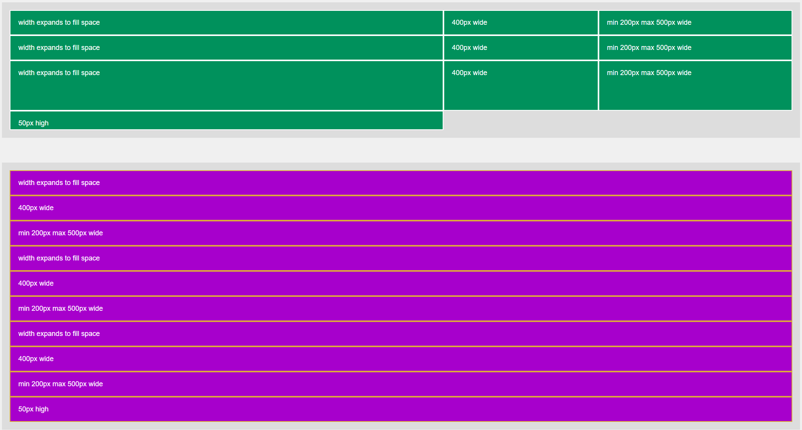
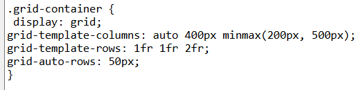

///////////////////////////////////////////////////////////////////////////////////////////////

.grid-container {
 display: grid;
grid-template-columns: auto 400px minmax(200px, 500px);
grid-template-rows: 1fr 1fr 2fr;
grid-auto-rows: 50px;
}
  