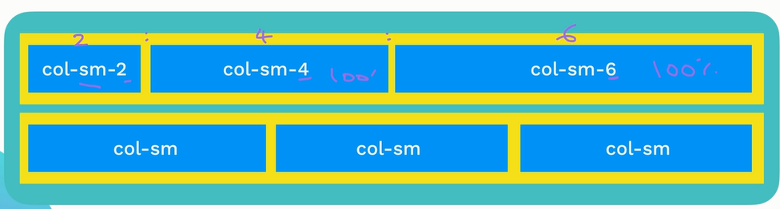
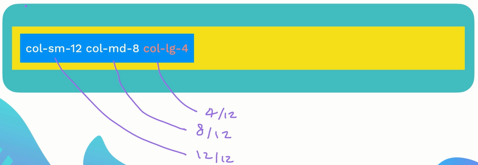
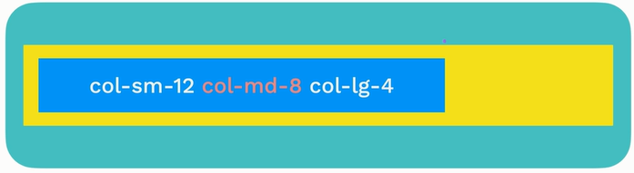
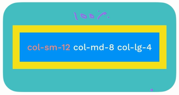
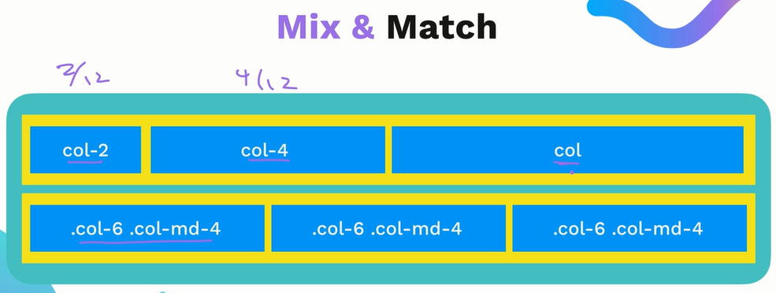
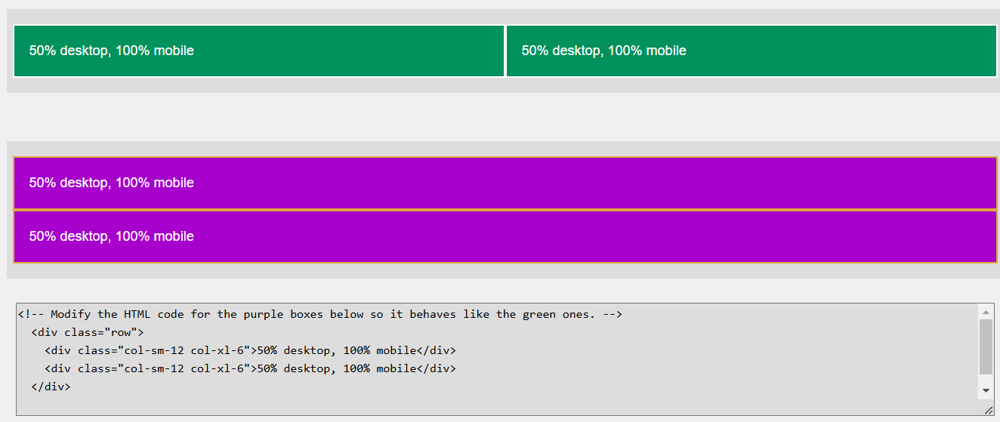
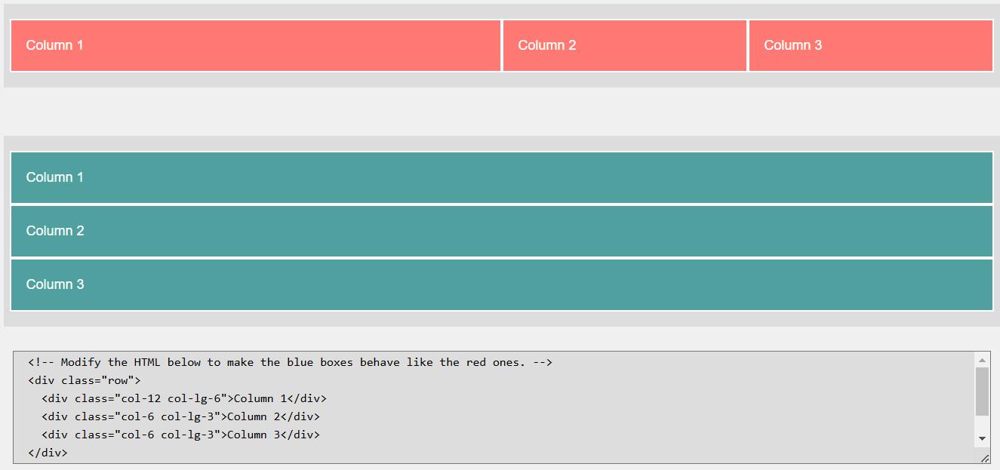
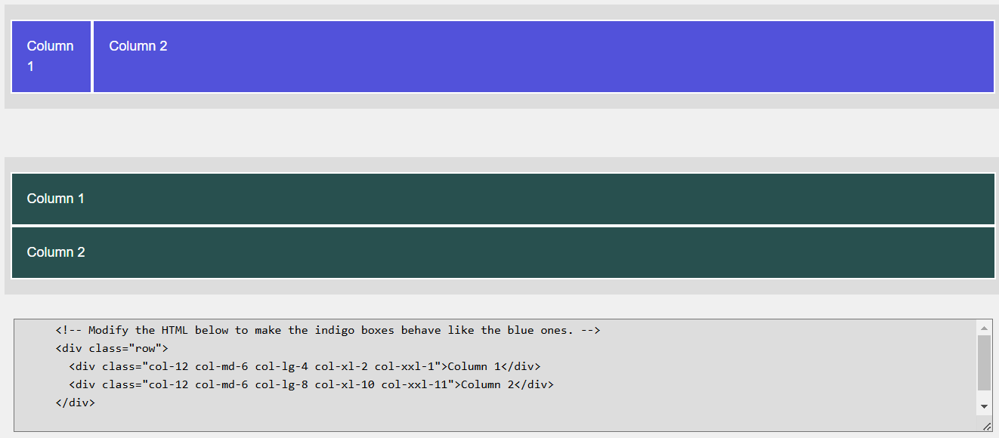

///////////////////////////////////////////////////////////////////////////////////////////////
Multiple Breakpoints

///////////////////////////////////////////////////////////////////////////////////////////////
Mix & Match

///////////////////////////////////////////////////////////////////////////////////////////////
Bootstrap Layout Exercise

    
50% desktop, 100% mobile

    
50% desktop, 100% mobile

    
Column 1

    
Column 2

    
Column 3

    
Column 1

    
Column 2

