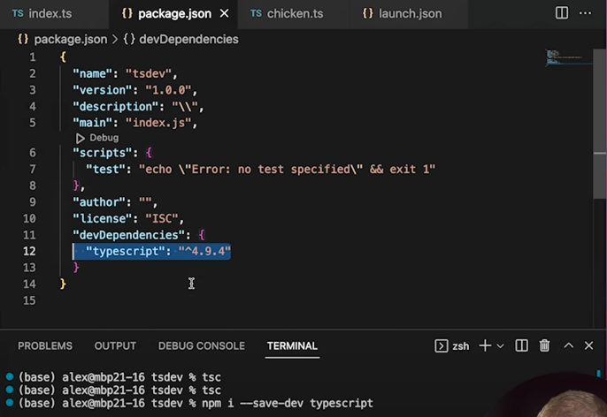
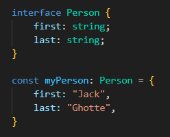
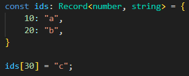

![[1]Create a launch.json file](image.png)
![[2]Create a launch.json file (wrong config)](image-1.png) 
![[3]Create a launch.json file - run 'tsc' to create our transpiled js & source map files in the specified folder according to tsconfig.json](image-2.png)
![[4]Create a launch.json file (correct config)](image-3.png)

![[2]Setting up Typescript Watch Process](image-5.png)
![[3]Setting up Typescript Watch Process](image-6.png)
![[4]Setting up Typescript Watch Process](image-7.png)
![[5]Setting up Typescript Watch Process](image-8.png)
![[6]Setting up Typescript Watch Process](image-9.png)

