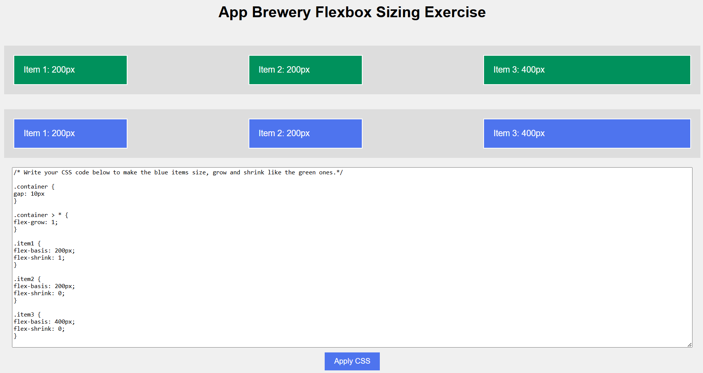
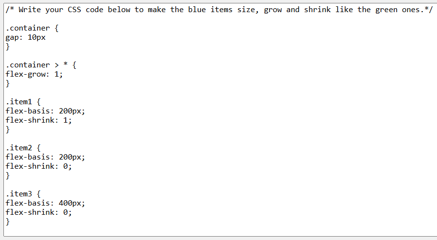

/* Write your CSS code below to make the blue items size, grow and shrink like the green ones.*/

.container {
gap: 10px
}
  
.container > * {
flex-grow: 1;
}

.item1 {
flex-basis: 200px;
flex-shrink: 1;
}

.item2 {
flex-basis: 200px;
flex-shrink: 0;
}

.item3 {
flex-basis: 400px;
flex-shrink: 0;
}
